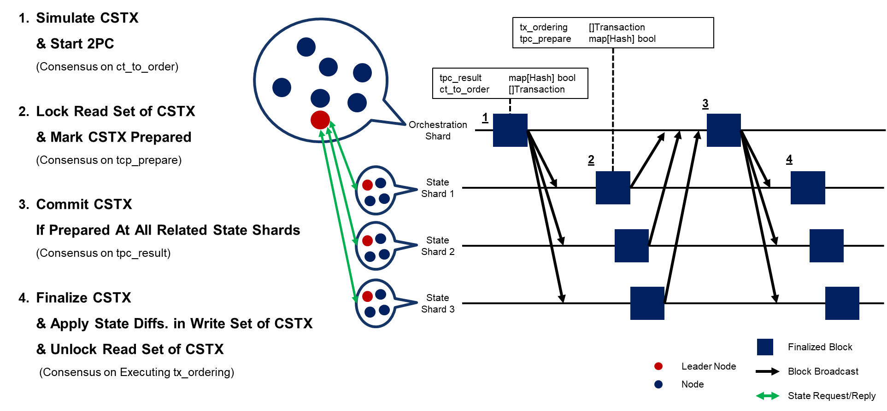

# Sharding Protocol V2

## Key Updates

### 1. Transaction Entry Point & Flow

**The transaction entry point has shifted from the Orchestration Shard to the State Shard.**

- **v1 (Legacy):** The entry point for cross-shard transactions was ambiguous or assumed to be led by the Orchestrator.
- **v2 (Current):**
    - **State Shard First:** All transactions are initially sent to the **State Shard** corresponding to the `To` address.
    - **Initial Simulation:** The State Shard performs a local simulation to determine if the transaction is a Local Tx or a Cross-shard Tx.
    - **Routing:**
        - `Local Tx`: Processed immediately within the State Shard (No Orchestration Shard involvement).
        - `Cross-shard Tx`: The `RwSet` is updated, and the transaction is forwarded to the Orchestration Shard.

### 2. Cross-Shard Simulation Strategy

**Enhanced security and efficiency via Iterative Re-execution with Merkle Proofs.**

- **v1 (Legacy): Interactive RPC**
    - Relied on a simple `Request(slot)` → `Reply` loop for every missing state access during execution, causing high network overhead.
- **v2 (Current): Iterative Re-execution & Validation**
    - **Pre-execution Validation:** Before simulation, the provided `RwSet` is validated using Merkle Proofs against the referenced State Root to ensure data integrity.
    - **NoStateError & Consistency:** If a `NoStateError` occurs (missing external state), the Orchestrator first verifies if the state accessed *so far* matches the declared `RwSet` to detect malicious behavior.
    - **Sub-call Delegation:** The specific call data (`Address`, `Data`) causing the error is sent to the target State Shard via `RwSetRequest`. The State Shard simulates *only that sub-call* locally to return the precise `RwSet`.
    - **Re-execution:** The newly received `RwSet` is merged, and the Orchestrator re-simulates the transaction from the beginning using the updated context.

### 3. 2PC Lifecycle & Explicit Transactions

**2PC processing now enforces strict block ordering and utilizes explicit internal transaction types.**

- **v1 (Legacy):** Relied on implicit mechanisms like the `tpc_prepare` flag.
- **v2 (Current):** Transactions must be arranged in `TxOrdering` following this strict sequence:

| Order | Transaction Type | Role | Note |
| --- | --- | --- | --- |
| **1** | `Finalize Transaction` | Applies final state changes (`WriteSet`) upon 2PC completion | Highest Priority |
| **2** | `Unlock Transaction` | Releases locks after transaction termination (Success/Abort) |  |
| **3** | `Lock Transaction` | Verifies `ReadSet` values and attempts to lock state | Fails if mismatch occurs |
| **4** | `Local Transaction` | Executes standard local transactions | Fails if accessing locked state |

### 4. Terminology & Data Structures

**Key naming conventions and structures have been updated at the code level.**

#### Renaming

- **Worker Shard** → **State Shard**
    - *Reason:* Emphasizes the role of managing state and performing initial verification rather than just "working."
- **ContractShardBlock** → **OrchestratorShardBlock**

#### Struct Updates (`RwVariable`)

The structure has been refined to enforce stricter verification logic.

```go
// v2 Update
type RwVariable struct {
    Address        common.Address
    ReferenceBlock Reference
    ReadSet        []ReadSetItem  // Explicit separation of Read/Write
    WriteSet       []WriteSetItem
}

type ReadSetItem struct {
    Slot  Slot
    Value []byte
    Proof [][]byte // Added Merkle Proof field (Verification mandatory)
}
```

---

## Terminology

- **Local Transaction**
    - Transaction that accesses state of only a single shard
    - Can be processed with a single intra-shard consensus
- **Cross-shard Transaction**
    - Transaction that accesses multiple shards
- **Orchestration Shard**
    - A shard that manages Two-Phase Commit Protocol for processing cross-shard transactions
    - Only one shard can be Orchestration Shard in the system
    - Runs light client of each State Shard to receive State Shard blocks, so that it can identify the latest state root and current status of 2PC protocol
    - Processes cross-shard transaction simulation to extract the fine-grained read/write set of cross-shard transactions
    - Does not maintain explicit state
    - Maintains every contract code that are deployed in State Shards (like a cache used for cross-shard transaction simulation)
- **State Shard**
    - All shards other than the Orchestration Shard
    - Finalizes state differences by the result of 2PC
    - Executes local transactions

---

## End-to-end Protocol for Cross-Shard Transaction

### Example Contract

#### TravelAgency Smart Contract

```solidity
// SPDX-License-Identifier: MIT
pragma solidity ^0.8.23;

contract TravelAgency {
  address public immutable trainBooking;
  address public immutable hotelBooking;
  mapping(address=>bool) customers;

  constructor(address _trainBooking, address _hotelBooking) {
    trainBooking = _trainBooking;
    hotelBooking = _hotelBooking;
  }

  function bookTrainAndHotel() public {
    bool trainAvailable;
    bool hotelAvailable;
    bool bookingSuccess;

    (trainAvailable, ) = trainBooking.staticcall(abi.encodeWithSignature("checkSeatAvailability()"));
    require(trainAvailable, "Train seat is not available.");

    (hotelAvailable, ) = hotelBooking.staticcall(abi.encodeWithSignature("checkRoomAvailability()"));
    require(hotelAvailable, "Hotel room is not available.");

    (bookingSuccess, ) = trainBooking.call(abi.encodeWithSignature("bookTrain(address)",msg.sender));
    require(bookingSuccess, "Train booking failed.");

    (bookingSuccess, ) = hotelBooking.call(abi.encodeWithSignature("bookHotel(address)",msg.sender));
    require(bookingSuccess, "Hotel booking failed.");

    customers[msg.sender] = true;
  }
}
```

#### Train Smart Contract

```solidity
// SPDX-License-Identifier: MIT
pragma solidity ^0.8.23;

contract TrainBooking {
  uint256 public constant MAX_SEATS = 300;
  uint256 public ticketSold;
  address[MAX_SEATS] public tickets;

  function checkSeatAvailability() public view {
    require(ticketSold < MAX_SEATS, "No more ticket available");
  }

  function bookTrain(address account) public {
    tickets[ticketSold++] = account;
  }
}
```

#### Hotel Smart Contract

```solidity
// SPDX-License-Identifier: MIT
pragma solidity ^0.8.23;

contract HotelBooking {
  uint256 public constant MAX_ROOMS = 300;
  uint256 public roomReserved;
  address[MAX_ROOMS] public rooms;

  function checkRoomAvailability() public view{
    require(roomReserved < MAX_ROOMS, "No more room available");
  }

  function bookHotel(address account) public {
    rooms[roomReserved++] = account;
  }
}
```

### Types

```go
type BlockHash [32]byte

type OrchestratorShardBlock struct {
    Height    uint64          `json:"height"`
    PrevHash  BlockHash       `json:"prev_hash"`
    Timestamp uint64          `json:"timestamp"`
    TpcResult map[string]bool `json:"tpc_result"`  // txID -> committed
    CtToOrder []Transaction   `json:"ct_to_order"` // New cross-shard txs
}

type StateShardBlock struct {
    ShardID    int             `json:"shard_id"`    // Which shard produced this block
    Height     uint64          `json:"height"`
    PrevHash   BlockHash       `json:"prev_hash"`
    Timestamp  uint64          `json:"timestamp"`
    StateRoot  common.Hash     `json:"state_root"`
    TxOrdering []Transaction   `json:"tx_ordering"` // Local + cross-shard txs
}

type Transaction struct {
    ID           string         `json:"id,omitempty"`
    TxHash       common.Hash    `json:"tx_hash,omitempty"`
    From         common.Address `json:"from"`
    To           common.Address `json:"to"`
    Value        *BigInt        `json:"value"`
    Gas          uint64         `json:"gas,omitempty"`
    Data         HexBytes       `json:"data,omitempty"`
    RwSet        []RwVariable   `json:"rw_set"`
    IsCrossShard bool           `json:"is_cross_shard"`
}

type Slot common.Hash

type Reference struct {
    ShardNum    int         `json:"shard_num"`
    BlockHash   common.Hash `json:"block_hash"`
    BlockHeight uint64      `json:"block_height"`
}

type ReadSetItem struct {
    Slot  Slot     `json:"slot"`
    Value []byte   `json:"value"`
    Proof [][]byte `json:"proof"` // Merkle proof (empty for now, deferred)
}

type WriteSetItem struct {
    Slot     Slot   `json:"slot"`
    OldValue []byte `json:"old_value"` // Value before simulation
    NewValue []byte `json:"new_value"` // Value after simulation
}

type RwVariable struct {
    Address        common.Address `json:"address"`
    ReferenceBlock Reference      `json:"reference_block"`
    ReadSet        []ReadSetItem  `json:"read_set"`
    WriteSet       []WriteSetItem `json:"write_set"` // Now includes values
}
```

### 0. Broadcast Transaction

1. A transaction is sent to State Shard of `To` address
2. State Shard simulates transaction to check for cross-shard access (can be identified with execution errors)
3. During the simulation, State Shard updates Transaction's `RwSet`
    - If it is cross-shard transaction, update `RwSet` with all state variables accessed until NoStateError
    - If it is local transaction, update whole `RwSet`
4. Sent to Orchestration Shard if it is identified as a cross-shard transaction (if not, it is stored at State Shard's mempool)

### 1. Cross-Shard Transaction Simulation

Orchestration Shard initiates cross-shard transaction simulation right after receiving cross-shard transactions

```go
type RwSetRequest struct {
    Address          common.Address
    Data             HexBytes
    ReferenceBlock   Reference
}

type RwSetReply struct {
    RwVariable       []RwVariable
}

func simulateCall(cstx *Transaction) {
    // Loop until simulation completes or fails permanently
    for {
        // Step 1: Validate RwSet using Merkle Proof and state root
        // ReferenceBlock refers to the snapshot used for this simulation
        isValid := validateMerkleProof(cstx.RwSet, cstx.ReferenceBlock.StateRoot)
        if !isValid {
            handleInvalidTx(cstx, "Invalid Merkle Proof")
            return
        }

        // Step 2: Set state of ReadSetItem
        // Initialize a temporary StateDB with the data currently available in cstx.RwSet
        tempStateDB := NewStateDB()
        tempStateDB.ApplyReadSet(cstx.RwSet.ReadItems)

        // Step 3: Start simulating EVM call
        evm := NewEVM(tempStateDB)
        result, err := evm.Call(cstx.From, cstx.To, cstx.Data)

        // Case A: Execution Successful
        if err == nil {
            finalizeSimulation(cstx, result)
            return
        }

        // Case B: NoStateError (External Call to another shard required)
        if isNoStateError(err) {
            // Check consistency: Compare declared RwSet vs Actual accessed state so far
            accessedSoFar := tempStateDB.GetAccessedItems()
            if !verifyConsistency(cstx.RwSet, accessedSoFar) {
                handleInvalidTx(cstx, "RwSet inconsistency detected")
                return
            }

            // Prepare Request for the corresponding State Shard
            // Extract the call data that caused the NoStateError
            missingCall := err.GetCallInfo()
            targetShardID := getShardID(missingCall.Address)

            req := RwSetRequest{
                Address:        missingCall.Address,
                Data:           missingCall.Data,
                ReferenceBlock: cstx.ReferenceBlock,
            }

            // Step 4 & 5: Request RwSet and Wait for Reply
            // The State Shard will simulate locally and return its RwSet
            reply := sendRwSetRequest(targetShardID, req) // Blocking call

            // Update cstx.RwSet with new variables from the State Shard
            cstx.RwSet.Merge(reply.RwVariable)

            // Step 6: Repeat from Step 1 with the expanded RwSet
            continue
        }

        // Case C: Other EVM Errors (Revert, OOG, etc.)
        handleExecutionFailure(cstx, err)
        return
    }
}
```

1. Validate `RwSet` of the cross-shard transaction using Merkle Proof and state root of the referencing block (Skip validation for already validated ones)
2. Set state of `ReadSetItem`
3. Start simulating EVM call
4. If NoStateError occurs by external call:
    1. Check whether the `RwSet` field of `Transaction` and state variables that are actually accessed during simulation until NoStateError are identical
    2. Request RwSet to the corresponding State Shard using the data of external call that caused NoStateError
    3. State Shard that received RwSetRequest simulates that call to extract RwSet of its shard until NoStateError occurs, and sends RwSetReply back to Orchestration Shard
    4. Append newly extracted RwSet into `RwSet` of the cross-shard transaction
    5. Repeat from Step 1 to re-simulate cross-shard transaction from the point of external call that caused the simulation to stop
5. Simulation is done

### 2. Two-Phase Commit



#### Phase 1 (Orchestrator Shard)

1. Orchestration Shard collects cross-shards transactions that have complete read/write set, and batches them into `CtToOrder`
2. Orchestration creates Orchestration Shard Block with CtToOrder, and broadcasts it to State Shards

#### Phase 1 (State Shard)

1. When State Shard receives Orchestration Shard Block, it creates Lock transactions (tries to lock state access of other transactions) for every `ReadSetItem` of cross-shard transactions inside `CtToOrder`, and stores them inside its mempool
2. State Shard creates `TxOrdering` with a batch of transaction with the following sequential order:
    - **Finalize transaction**
        - Finalizes differences caused by cross-shard transactions by applying new value of `WriteSet`
    - **Unlock transaction**
        - Unlocks the state variables locked by the completed cross-shard transaction whether it succeeded or aborted
    - **Lock transaction**
        - Tries to lock the state access of other transactions for integrity
        - Fails if the current value of state variable are different from the value used in simulation (`ReadSetItem` of cross-shard transaction)
    - **Local transaction**
3. State Shard creates a State Shard Block with `TxOrdering` and sends it to Orchestrator Shard

#### Phase 2 (Orchestrator Shard)

1. By receiving each State Shard blocks, Orchestrator Shard identifies the result of 2PC
    - If all Lock transactions for specific cross-shard transaction succeed at each State Shard, that cross-shard transaction is set to prepared (If not, aborted)
2. Orchestrator Shard batches the result of cross-shard transaction 2PC into `TpcResult`
3. Orchestrator Shard creates Orchestrator Shard Block with `TpcResult`, and broadcasts it to State Shards

#### Phase 2 (State Shard)

1. When State Shard receives Orchestration Shard Block, it creates Finalize and Unlock transactions with the result data inside `TpcResult` and cached transaction data during phase 1, and stores them inside its mempool
2. State Shard creates `TxOrdering` with a batch of transaction with the following sequential order:
    - Finalize transaction
    - Unlock transaction
    - Lock transaction
    - Local transaction
3. State Shard creates a State Shard Block with `TxOrdering` and sends it to Orchestrator Shard

> **Note:** Phase 1 and Phase 2 can be processed in parallel (Phase 2 of previous CtToOrder and Phase 1 of current CtToOrder)

---

## End-To-End Protocol for Local Transaction

### 0. Broadcast Transaction

1. A transaction is sent to State Shard of `To` address
2. State Shard simulates transaction to check for cross-shard access (can be identified with execution errors)
3. During the simulation, State Shard updates Transaction's `RwSet`
    - If it is cross-shard transaction, update `RwSet` with all state variables accessed until NoStateError
    - If it is local transaction, update whole `RwSet`
4. Sent to Orchestration Shard if it is identified as a cross-shard transaction (if not, it is stored at State Shard's mempool)

### 2. Local Transaction Execution

1. State Shard creates `TxOrdering` with a batch of transaction with the following sequential order:
    - Finalize transaction
    - Unlock transaction
    - Lock transaction
    - Local transaction
        - Fails when it tries to write on locked state variable
2. State Shard creates a State Shard Block with `TxOrdering` and sends it to Orchestrator Shard

---

## Implementation Notes

This section documents differences between the design specification above and the actual codebase implementation. These are intentional architectural choices, not bugs.

### CtToOrder Type

**Design:** `CtToOrder []Transaction` (line 190)

**Implementation:** `CtToOrder []CrossShardTx` in `protocol/types.go`

**Reason:** The implementation uses `CrossShardTx` which is a superset of `Transaction` with additional fields for cross-shard coordination (simulation status, error tracking, etc.). This is functionally equivalent but more explicit about the cross-shard nature of these transactions.

### Cross-Shard State Fetching

**Design:** Iterative re-execution with `NoStateError` detection and `RwSetRequest/RwSetReply` flow (Section 1, Steps 4-5)

**Implementation:** Single-pass execution with lazy state fetching in `orchestrator/simulator.go`

**How it works:**
- `SimulationStateDB` lazily fetches state from any shard on-demand during EVM execution
- When EVM accesses an address (via CALL, SLOAD, etc.), `getOrFetchAccount()` transparently fetches bytecode and balance via HTTP from the owning shard
- When EVM reads storage (SLOAD), `GetStorageAt()` fetches the specific slot from the owning shard via HTTP
- All accessed addresses and storage slots are tracked during execution
- At the end of single-pass execution, `BuildRwSet()` constructs the complete RwSet from tracked reads/writes

**Benefits:**
- **Simpler architecture:** No iteration loop, no tracer, no re-execution needed
- **On-demand fetching:** State is fetched only when accessed, not pre-fetched
- **Single HTTP request per unique state access:** Each bytecode/storage slot fetched once and cached

**Trade-off:**
- Multiple HTTP requests for contracts with many storage reads (vs batched `RwSetRequest`)
- Acceptable for PoC; can be optimized with batch fetching if needed

See `orchestrator/simulator.go:runSimulation()` for the single-pass execution flow.

### Merkle Proofs (V2.3)

**Status:** ✅ Implemented

#### Overview

V2.3 implements Merkle proof generation and verification for storage slot data responses, enabling trustless cross-shard state verification.

#### Proof Generation (State Shard)

**Endpoint:** `GET /evm/storage/{address}/{slot}?proof=true`

State Shards can now generate Merkle proofs for storage slots using the `EVMState.GetStorageWithProof()` method:

```go
// internal/shard/evm.go
func (e *EVMState) GetStorageWithProof(addr common.Address, slot common.Hash) (*protocol.StorageProofResponse, error)
```

**Response Format:**
```json
{
  "address": "0x1234...",
  "slot": "0xabcd...",
  "value": "0x5678...",
  "state_root": "0xdeadbeef...",
  "block_height": 42,
  "account_proof": ["0x...", "0x...", ...],
  "storage_proof": ["0x...", "0x...", ...]
}
```

The proof consists of two parts:
1. **Account Proof:** Merkle path from state root to the account, proving the account exists and providing its storage root
2. **Storage Proof:** Merkle path from storage root to the specific slot, proving the slot's value

#### Proof Verification (Orchestrator)

**Function:** `VerifyStorageProof()` in `internal/orchestrator/statefetcher.go`

The Orchestrator can verify proofs in four steps:
1. Verify account proof against state root
2. Extract storage root from verified account (RLP-decoded)
3. Verify storage proof against storage root
4. Confirm retrieved value matches claimed value

**Usage:**
```go
// Optional proof verification during storage fetch
value, err := sf.GetStorageAtWithProof(txID, shardID, addr, slot, verifyProof=true)
```

#### Implementation Details

**Files Modified:**
- `internal/protocol/types.go`: Added `StorageProofResponse` struct
- `internal/shard/evm.go`: Added `GetStorageWithProof()`, `getAccountProof()`, `getStorageProof()`
- `internal/shard/server.go`: Extended `handleGetStorage` to support `?proof=true` query parameter
- `internal/orchestrator/statefetcher.go`: Added `VerifyStorageProof()`, `GetStorageAtWithProof()`, `parseProof()`

**Backwards Compatibility:**
- Legacy endpoint `GET /evm/storage/{address}/{slot}` (without `?proof=true`) returns just the value for backwards compatibility
- Proof verification is opt-in via the `verifyProof` parameter in `GetStorageAtWithProof()`

#### Current Limitations

1. **Proof population in RwSet:** The `ReadSetItem.Proof` field is not yet populated during simulation. Storage reads currently use the legacy path without proof verification.
2. **Light client integration:** Orchestrator does not yet maintain light client state roots for each State Shard, so proof verification cannot validate against canonical shard state.
3. **Performance:** Proof generation uses go-ethereum's trie package which may have overhead for large proofs.

#### Future Work

- Populate `ReadSetItem.Proof` during cross-shard simulation
- Integrate proof verification into Lock transaction validation
- Add light client infrastructure for canonical state root tracking
- Optimize proof generation for batch requests
